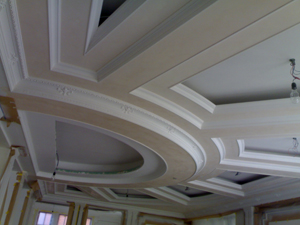



Способы дизайна потолков из гипсокартона

Если бы вы делали ремонт 15 – 20 лет назад, то вы бы даже не задумывались о потолочном дизайне. Тогда, самое главное, чтобы потолок был ровный, аккуратный и покрыт обычной побелкой. Но время не стоит на месте, сейчас потолочному дизайну уделяется много внимания, это один из самых важных этапов в ремонте. Потолок является важным аспектом интерьера, он может полностью преобразить все комнаты своей цветовой гаммой. С помощью различных цветов потолка можно по-разному выделить какие-то определенные элементы комнаты. Чтобы сделанный ремонт радовал вас, был вполне уютным и комфортным, да и чтобы ваши соседи позавидовали, стоит обратить внимание на дизайн гипсокартоновых потолков.

Возможно несколько вариантов дизайна гипсокартона, рассмотрим их в порядке увеличения их стоимости и сложности.

Первый вариант является дешевым, да и самым грязным – это побелка или же окрашивание потолка. Если Вас такой вариант устраивает, то необходимо помнить, что: 1) такую работу следует выполнять в начале вашего ремонта, перед ремонтом полов и стен; 2) очень важно, чтобы потолок был исключительно ровным, иначе все его изъяны будут хорошо видны. Такой вариант дизайна потолка является не совсем уж простым и скучным. Вы можете покрасить потолок в такой цвет, чтобы он сочетался с интерьером вашей комнаты: с цветом стен или дверей, а также с любыми другими вещами или же мебелью. Можно покрасить потолок в разные цвета в разных участках вашей комнаты, тоже самое можно сделать и с побелкой.

Второй вариант дизайна потолка – оклеивание плиткой. Можно оклеить потолок специальной квадратной плиткой, она очень легкая, так как сделана из пенопласта. Ее размеры: 50 мм2 или же 60 мм2. Клеить такую плитку следует на очищенную поверхность потолка с помощью специального клея. Ни в коем случае нельзя использовать жидкие гвозди, клей «Момент» или же эпоксидный клей, так как из-за их воздействия, плитка может повредиться или деформироваться. Существует множество вариантов для оформления потолка пенопластовой плиткой, она бывает разных цветов, с всевозможными узорами и структурой. Благодаря одинаковому размеру всех плиток, можно составить различные сочетания плиток с разными оформлениями.

Более сложным способом дизайна гипсокартона является оклеивание его обоями. Этот способ занимает третье место по сложности из-за того, что в отличие от потолочной плитки, обои больше в размере и уступают в прочности. Поэтому для новичка в этом деле такая работа может показаться не столь простой. Но по другим критериям, таким как: цветовая гамма и фактура, обои совпадают с пенопластовой плиткой. Важный совет: не оклеивайте потолок слишком яркими цветами и обоями с большими рисунками.

Рассмотрим следующий способ потолочного дизайна – это подвесной потолок из листов гипсокартона. В основном такой вариант дизайна выбирают, чтобы скрыть все неровности потолка. Но, даже если у вас совершенно ровные потолки, можно поэкспериментировать с помощью гипсокартона, чтобы придать потолку новую форму. Кроме как создания новых геометрических форм, вы можете разными способами расположить свои светильники, тем самым оригинально оформить освещение комнаты. Можете расположить светильники по периметру комнаты, можете спрятать их между уровнями, чтобы их не было видно, а можете даже расположить их несимметрично. Сделать оригинальную форму потолка из гипсокартона не является всеми достоинствами такого дизайна. Этот материал легко поддается окрашиванию, оформлению различными панелями или же оклейке обоями. Гипсокартон легкий и удобный материал, с ним не сложно обращаться даже новичкам в этом деле. Но все же лучше довериться хорошим специалистам в этом деле, чтобы избежать неудачного моделирования и монтажа, ведь из-за этого можно испортить материал и придется приобретать новый.

А вот панельные или же реечные потолки в основном используются потолочного дизайна в офисе, туалете, ванной или в магазине. Реечный потолок представляет собой рейки, длина которых достигается до 4 м, а ширина составляет 85 мм. В основном такие рейки бывает следующих цветов: белые, золотые или серебряные цвета. Панельные потолки изготавливают из подвесных конструкций, которые состоят из плиток и реек. Размер плиток: 60 мм2 или же 62 мм2. Цветовая гамма таких плиток заключается в белом и сером цветах, но это легко исправить, перекрасив плитки в нужный вам цвет. Производить самостоятельно установку таких потолков достаточно сложно.

[Дальше](desing2.html)

