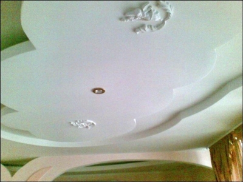
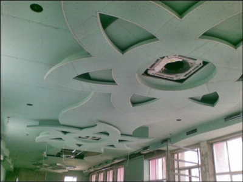
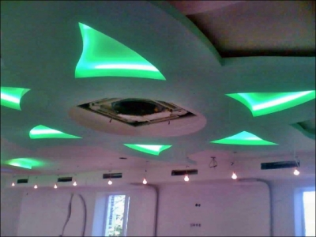
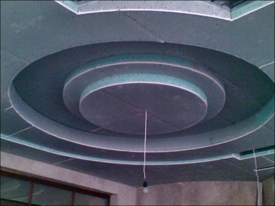
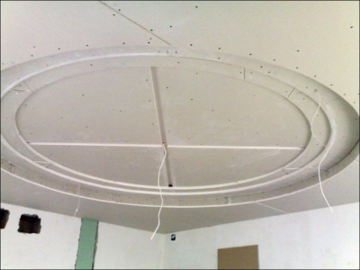
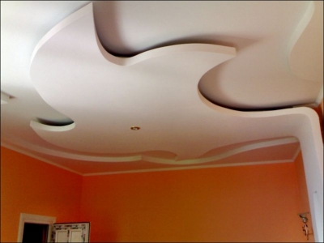
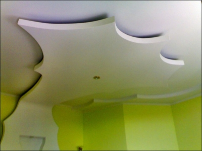
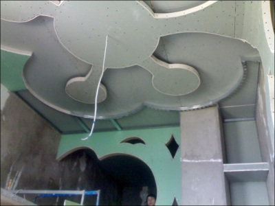



    
    
    <ul id="portfolio" class="clearfix">
      <li></li>

      <li></li>

      <li></li>

      <li></li>

      <li></li>

      <li></li>

      <li></li>

      <li></li>

      <li></li>
      
    </ul>
  

