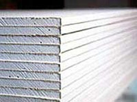



{: style="float:right; margin:10px"}

Мы живём в эпоху технического прогресса, который царствует и на строительном рынке. Современные профессионалы всё активнее отдают предпочтение высокотехнологичным и многофункциональным разработкам: неудивительно, что практически каждый ремонт помещения, будь-то загородный домик или роскошный особняк мегаполиса, не обходится без работы с гипсокартономмонтажа гипсокартона. Не зря производство гипсокартона успешно освоил даже отечественный производитель.

Зачем нужен гипсокартон? Область его применения — почти безгранична. С его помощью можно с лёгкостью создавать стены из гипсокартона, потолки, перегородки из гипсокартона, арки из гипсокартона.Стена из гипсокартона будет эстетически красивой, ровной и функциональной; межкомнатная перегородка из гипсокартонасумеет с минимальными затратами разделить жилплощадь на участки, а неотъемлемый аттрибут практически любого современного интерьера,арка из гипсокартона придаёт жилищу особый, неповторимый шарм.Работа с гипсокартоном - это раздолье для дизайнерской фантазии, это простота монтажа гипсокартона, это возможность за относительно небольшие средства превратить ремонтируемое помещение в живое воплощение мечты.

  Свойства гипсокартона — уникальны. Он нетоксичен, его кислотность идентична оной человеческой кожи, он гибок и может принимать самые невероятные формы, отражающие практически любую вашу идею. Видов и модификаций гипсокартона существует огромное количество, для каждого вида и типа помещения. Так, чердакам подойдёт пожаропрочный гипсокартон, ванным комнатам — влагостойкий, гипсокартон же и влагостойкий и пожароустойчивый подойдёт для обеих типов помещений.

Мы расскажем вам всё о работе с гипсокартоном: о правильноммонтаже гипсокартона, о создании перегородок, арок, стен из гипсокартона, о профилях гипсокартона, о его производстве. Читайте нашу строительную энциклопедию и ремонт среднего/начального уровня станет возможным даже собственными руками. не отставайте от строительного прогресса.