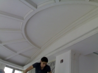



<!-- Featured News -->

	

		

		

			
<a href="montag1.html">Монтаж гипсокартона</a>

			
03-03-2009

			
Перегородки из гипсокартона обладают огромными преимуществами перед обычными перегородками:
быстрый монтаж;<a href="montag1.html">Читать дальше...</a>

		

	

	

		

		

			
<a href="potolki.html">Потолоки из гипсокартона</a>

			
04-03-2009

			
Потолок из гипсокартона дает огромный простор для дизайнерской фантазии.Тут можно сделать практически всё, и многоуровневый потолок, и визуальное разделение пространства<a href="potolki.html">Читать дальше...</a>

		

	

	

		

		

			
<a href="stena.html">Стены из гипсокартона</a>

			
05 May 2013 

			
Очень выгодной и эффективной отделкой стен, а также потолков является отделка гипсокартоном. Проще говоря, это ведь обычная сухая штукатурка. Отделка стен и потолка таким материалом является более простым методом, чем обычная мокрая штукатурка<a href="stena.html">Читать дальше...</a>

		

	

	

		

		

			
<a href="desing1.html">Стены из гипсокартона</a>

			
05-03-2009 

			
Если бы вы делали ремонт 15 – 20 лет назад, то вы бы даже не задумывались о потолочном дизайне. Тогда, самое главное, чтобы потолок был ровный, аккуратный и покрыт обычной побелкой. Но время не стоит на месте, сейчас потолочному дизайну уделяется много внимания<a href="desing1.html">Читать дальше...</a>

		

	

	

		

		

			
<a href="paint.html">Окраска гипсокартона</a>

			
06-03-2009 

			
Для того чтобы окраска гипсокартона прошла нормально следует выполнять некоторые правила:<a href="paint.html">Читать дальше...</a>

		

	

	

		

		

			
<a href="work.html">Работа с гипсокартоном</a>

			
07-03-2009 

			
Начинать работу следует с определения количества материала необходимого для выполнения ремонта. Поэтому для начала стоит замерить площадь помещения, и закупить необходимое количество материала. Лучше всего покупать гипсокартон с запасом, чтобы не приходилось бегать в магазин.<a href="work.html">Читать дальше...</a>

		

	

	

		

		

			
<a href="profili.html">Профили для гипсокартона</a>

			
08-03-2009 

			
Профили гипсокартона главным образом подразделяются на 2 группы:Это основные: ПС или CW, ПП или CD а также направляющие: ПН или UD, UW<a href="profili.html">Читать дальше...</a>

		

	

<!-- End Featured News -->
