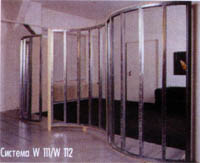



Перегородки из гипсокартона обладают огромными преимуществами перед обычными перегородками:

- быстрый монтаж;
- минимальные затраты на процессы наложения штукатурки;
- идеально ровные поверхности под дальнейшую отделку;
- обладают небольшим весом, примерно 25-50 кг/м2;
- хорошо звукоизолирует и является огнестойким материалом;
- возможно скрытие монтажных коммуникаций.

Алгоритм монтажа гипсокартона

Начать нужно с разметки. Используя трассировочный шнур,  задайте главную ось на полу. Потом необходимо отметить расположение проемов для дверей. Затем, используя отвес и все тот же трассировочный шнур, перенесите ось на стены, а также на потолок.

Рассмотрим монтаж направляющих у гипсокартона. С тыльной стороны у направляющих профилей нужно обклеить специальной лентой, чтобы обеспечить звукоизоляцию. После этого их крепят к потолку и полу, создавая разрывы на тех местах, где будут расположены двери. Крепеж направляющих осуществляется дюбелями из пластмассы и шурупами, размеры которых составляют 8x60 мм, 6x40 мм или же 6x60 мм. Дюбеля стоит забивать не реже 10 см, и так, чтобы на любой профиль приходилось три дюбеля.

Приступим к монтажу стоек гипсокартона. Сначала нужно вставить профили-стойки в нижние профили, а потом в верхние. Получившаяся стойка должна вставляться в направляющую, расположенную на потолке, примерно на 2 см. После этого происходит выравнивание профилей по вертикали, шаг должен сохраняться не мене 60 см. Если открытая сторона смотрит в сторону монтажа, то такая установка называется немецкой. Если же в сторону монтажа направлен только 1-ый профиль, то такая установка носит американское название.

Переходим к обшивке 1-ой стороны. При монтаже гипсокартона его обшивка делается по всей ширине 12 см. Чтобы закрепить гипсокартон, нужно использовать саморезы по металлу, размеры которых 25 мм в длину и с шагом в 25 см. Если же вы обшиваете в два слоя, то шаг этих саморезов составляет 75 см.

Начинаем укладывать изоляцию в отверстие гипсокартонной перегородки. Если вы завершили обшивку одной стороны, то нужно вмонтировать коммуникации в полости перегородок. После этого следует уложить стекловату в нужную толщину. Такая изоляция должна хорошо заполнять пустые места между нашими профилями, а также следует избежать ее сползания.

Далее следует монтаж 2-ой стороны нашей перегородки. Имеющиеся швы по вертикали между нашими гипсокартонными листами следует сместить на шаг в 60 см относительно обшивки 1-ой стороны. Тем самым, такой монтаж гипсокартона реализовывается в 60 см с ГКЛ в половины ее ширины. Если же вы используете двухслойную обшивку гипсокартоном, то второй слой стоит укладывать с полной ширины листа.
