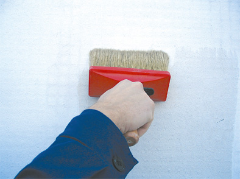



Для того чтобы окраска гипсокартона прошла нормально следует выполнять некоторые правила:

{: style="float:right; margin:10px"}

1.	После того как все соединения в гипсокартоновой конструкции высохли, следует положить слой шпаклевки или герметика.

2.	Если Вы хотите скрыть дефекты гипсокартонового покрытия то следует использовать краску на водной основе, так как она придаст эффект апельсиновой корки. Не рекомендуется использовать такую краску в помещениях с повышенной влажностью.

3.	Покраску вокруг дверей сначала проводите с помощью кисточки, а следом ворсовым валиком.

4.	Если в помещение, где будет находиться гипсокартоновое покрытие очень много света, то следует провести грунтовку поверхности. Так как при очень ярком освещении так же будут видны дефекты.

5.	Лучше всего использовать не блестящие, а матовые краски. Так как глянцевые краски хорошо отражают свет, а вместе с этим показывают дефекты поверхности гипсокартона.

6.	При покраске лучше использовать светлые тона, так как они будут скрывать возможные дефекты, но если Вы все-таки решили использовать темные цвета, то обратитесь к специалисту.

7.	Ели Вы будете наносить краску согласно прилагающейся инструкции, то сможете добиться лучшего результата.

Нет ничего сложного в том чтобы покрасить гипсокартон в нужный Вам цвет, зная эти простые правила Вы справитесь с этим на отлично.
