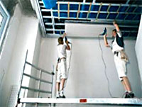



{: style="float:right; margin:10px"}

Гипсокартон имеет несколько преимуществ. Его применение позволяет
достичь очень ровной поверхности. Все мы прекрасно знаем, что случаях перепады могут достигать 8 и даже 10 сантиметров! Он позволит скрыть все трещины и не ровности потолка, кроме всего монтаж гипсокартона прост и не займёт много времени

####Потолок из гипсокартона дает огромный простор для дизайнерской фантазии 

Тут можно сделать практически всё, и многоуровневый потолок, и визуальное разделение пространства

Удивительно, но гипсокартонный потолок годится практически для любыхразличные выпуклые рисунки и многое другое. А какие< возможности дают растровые светильники. Можно сделать разноцветное свечение в разных зонах потолка, и разность свечения. Дизайн гипсокартона настолько разнообразен, что имеет смысл написать про это отдельную книгу.
Его можно сделать как в гостиной, так и в спальне. Для ванных комнат предусмотрены водоотталкивающие листы. Кроме всего прочего, гипсокартон считается экологически чистым материалом, так как он производится без всяких синтетических добавок, а только с использованием натуральных компонентов: гипса, картона, армированного волокна.

Кислотные показатели гипса приблизительно равны человеческим, поэтому он не оказывает вредного воздействия на человека. Преимущество гипсокартонного потолка ещё и в том, что он обладает высокими звукоизоляционными свойствами и огнестойкости.

Так что, если у вас шумные соседи сверху, смело вам рекомендуем ставить такие потолки, так вы убережёте свои нервы. Но следует взять во внимание, что гипсокартон не сможет противостоять потопу. Так что если вас залью соседи, вы обретёте приличную порцию хлопот. Если такое произошло, прежде стоит подождать, пока потолок высохнет, а

Прежде чем окончательно решиться, ставить гипсокартонный потолок или нет, примите к сведению следующие моменты.

Определитесь сколько место вы хотите отдать потолку. Например, обычный светильник, имеет высоту 90мм, то есть уже минимум надо оставлять 10 см. Помимо этого, потолок должен скрывать трубы, провода, вентиляционные короба, поэтому потолок будет ещё ниже.

Монтаж гипсокартона осуществляют специалисты. Так что стоимость 1 квадратного метра такого потолка вместе с работой и покраской будет стоить в районе 20-25 уе, что примерно в полтора раза дешевле тех же натяжных потолков.

Но можно попробовать осуществить монтаж и самому, в этом случае вы сэкономите, чуть ли не половину суммы. Но в одиночку, вы, скорее всего не справитесь.

Потолок из гипсокартона достаточно тяжеловесная конструкция. Вес одного квадратного метра составляет 15- 20 кг. Если учесть, что длина листа 2.5 метра ширина от 0.5 до 0.6 метров то одному такую конструкцию поднять практически не возможно, поэтому работать нужно как минимум вдвоём. Если уже есть опыт монтажа гипсокартона, то в день можно успеть сделать порядка 12-15 кв метров.

Если таки вы приняли решение установить потолок из гипсокартона вручную, значит приготовьте следующие инструменты: электродрель, перфоратор, ножницы по металлу, молоток + что-нибудь подходящее для штукатурных работ.

Монтаж потолка производится в нескольких этапов.

Первым делом отмечаем, где должен находиться нулевой уровень, после чего осуществляем монтаж профилей. Особое внимание уделите техническим характеристикам подвесной системы. Необходимо, чтобы она была рассчитана на нагрузку не менее 14 кг на квадратный метр. Сам колебаний. Иначе, на установленных потолках будут появляться трещины.

После этого основной каркас обшивают листами из гипсокартона. Образовавшиеся швы между гипсокартонными листами замазывают шпаклевкой для герметичности. Затем на эти швы приклеивают специальный бинт-серпянка, потом шпаклюют и все хорошо зашлифовывают. После приступают к последнему этапу работы к покраске потолка. Тут можно воспользоваться почти любой краской, самое главное правильно подобрать грунт.

Для правильной установки потолка из листов гипсокартона необходимо знать и соблюдать несколько несложных правил. Листы из гипсокартона не следует ставить на ребро, их лучше складывать в горизонтальном положении, так как этот материал легко подвергается деформации. Если вы собираетесь после установки гипсокартонных листов проводить влажные штукатурные и малярный работы, то вам лучше приобрести водостойкий гипсокартон. Но если потолок содержит множество изгибов или же арок, то можно купить обычный гипсокартон, так как он более пластичный, хорошо подвергается изгибам.

Хорошо установленный потолок из гипсокартона создает домашний уют и прослужит вам долгие годы.

[Для расчета потолков из гипсокартона воспользуйтесь нашим калькулятором](calc/index.php)