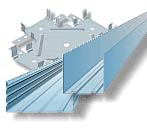



Профили гипсокартона главным образом подразделяются на 2 группы:

Это основные: ПС или CW, ПП или CD а также направляющие: ПН или UD, UW.Основные профили являются основанием для закрепления на них гипсокартонных листов, и они способны выдерживать достаточно большие нагрузки. Характерная для них черта С-образная форма краёв, рёбрами жёсткости и продольными гофрами.Направляющие же профили являются горизонтальными направляющими и в них вставляются вертикальные профили. Направляющие профили сделаны для фиксации самих гипсокартонных листов.

{: style="float:right; margin:10px"}

Кроме того, профили гипсокартона делятся на:

— потолочные направляющие ПН или UD;

— потолочные основные ПП или CD;

— стеновые стоечные ПС или CW;

— стеновые направляющие ПН или UW;

— угловой профиль;

— арочный профиль.

Размеры сечения профилей могут отличаться. Обычно, для потолочных направляющих размер 28 х 27 мм;, для потолочных основных: 60 х 27 мм; для стеновых стоечных: 50 х 50, 65 х 50, 75 х 50, 100 х 50 мм; ну и для стеновых направляющих: 50 х 40, 65 х 40, 75 х 40, 100 х 40 мм.

Металлопрофили

Наиболее распространёнными среди профилей гипсокартона являются металлопрофили или иначе металлические профили.Их делают из листа жести с оцинковкой толщиной 0,56 — 0,6 мм при помощи специального метода холодной прокатки.Полученные таким способом профили гипсокартона имеют более высокую прочность, жёсткость и легкость.Как известно, оцинковка предотвращает появление ржавчины на металле, поэтому профиль получается весьма долговечным.

пп — потолочные профили

Потолочный профиль (ПП 60/27) используется для подвесных потолков.
Закрепляется он по всему периметру, где будет находиться сам потолок.
Потолочный профиль С-образной формы позволяет формировать каркас для подвесных потолков
Его размеры составляют: а — 60 мм, b — 27 мм.
На потолке, а также на спинке профиля есть специальные канавки (всего их 3) предназначенные для центровки ввинченного шурупа, что придаёт ему дополнительной жесткости.Закрепление ПП-профиля к основанию производится при помощи подвесов. Наиболее характерным для этого случая является прямой подвес с зажимом.Чтобы было легче установить подвес с зажимом, края у полок профиля загибаются внутрь.Прямой подвес устанавливается на профиле путём ввинчивания обычных шурупов.

Достаточно широкая (60 мм) стенка является хорошим основанием для установки картонных листов.
В комплект подвесного потолка входят специальные соединители, которые упрощают процесс монтажа каркаса, позволяя сократить время установки потолков.

пнп — направляющие профили

Направляющий потолочный профиль ((ПНП 28/27) используется в качестве направляющей ПП-профилей 60/27 при осуществлении монтажа каркаса подвесного потолка П113, а также и при облицовке С623.
ПНП-профиль при монтаже каркаса подвесного потолка устанавливается по всему периметру помещения.
Если устанавливается каркас облицовки, то профиль крепится и к потолку и к полу.
На спинке профиля есть отверстия, каждое диаметром по 8 мм. Располагаются они друг за другом на расстоянии 250 мм и служат для вставки дюбелей, с помощью которых и будет произведено крепления направляющей к несущему основанию.

пс — стоечный профиль

Стеновой стоечный профиль ((ПС) также имеет С-образную форму и представляет собой вертикальные стойки каркасов для гипсокартонных перегородок а также облицовок.
Установка стоечного профиля производится в паре с направляющим.
Значительное облегчение процесса установки вносит полка стоечного профиля с шириной 50 мм. Она блокирует попадание шурупов мимо полки. Монтаж листов осуществляется в том же направлении, что и открытая часть профиля.При такой закономерности монтажа, установка шурупов будет происходить ближе к стенке, что не даст шурупу отогнуть полку профиля изнутри.Основным преимуществом у профиля гипсокартона являются наличие продольных канавок на полке профиля, которые будут центрировать шуруп при его закручивании.Также они послужат ориентиром при сборке каркаса и установке листов гипсокартона.На спинке каждого конца профиля гипсокартона есть два отверстия размером 33 мм, позволяющие осуществлять монтаж коммуникаций внутри перегородок.

При выборе облицовочный профиля нужно ориентироваться на требования звукоизоляции и соответственно выбирать однослойную или двухслойную конструкцию.Стоечный профиль ПС устанавливают в направляющей при помощи шурупов или с применением просекателя путём просечки с отгибом.

пн — стеновой профиль

Стеновой направляющий профиль ((ПН) изготавливают с целью создания рамки под каркас стен.
Направляющие стеновые профили ПН, представляют С-образную форму и применяются в качестве направляющих стоечных профилей, а также в качестве устройства перемычек между ними в каркасах перегородок и для облицовок.
Он крепится продольно от пола и до потолка.Металлические профили устанавливаются при помощи специальных дюбелей и нарезных шурупов.Монтируются они вместе с одинаковым по размеру ПС-профилем.Направляющие профили в большинстве случаев, изготавливаются уже со сделанными отверстиями в спинке профиля под установку дюбелей, что непременно упрощает процесс крепления профиля к самому основанию.Если есть какая-либо необходимость, то отверстия можно сделать и самому обычной дрелью.

Размер стеновых направляющих и стоечных профилей выбирается исходя из требований шума изоляции, а также характеристиками будущей перегородки.Эти профили обладают ещё одним преимуществом: в них уже есть готовые отверстия по 30мм под электропроводку.

пу — профиль угловой

Профиль угловой ((ПУ-профиль 31/31) находится сверху гипсокартонного листа и применяется для сглаживания углов, а также защиты от внешнего физического воздействия.При установке каркаса подвесного потолка ПНП-профиль монтируется по периметру помещения.При установке каркаса облицовки, профиль закрепляется к потолку и к полу.На спинке профиля имеются отверстия диаметром по 8 мм, расположенные на расстоянии 250 мм для крепления направляющей к несущему основанию при помощи дюбелей.

па — профиль арочный

Профиль арочный (ПА) такой профиль позволяет создавать оригинальные формы потолка и арочных проёмов. Часто их называют гнутыми профилями.и.Такой профиль делается на основе основного профиля и имеет сечение 60 х 27 мм.
Как его изогнуть решает дизайнер, но главное не переступить порог, максимальный радиус гибки 500мм...Гибка может быть сделана как полками внутрь, так и наружу, от чего собственно и будет зависеть вид потолка.Наибольшая длина дуги у арочного профиля ПА составляет 6000 мм.

Каркасные основы для гипсокартона позволяют реализовать многие не обычные дизайнерские проекты.

