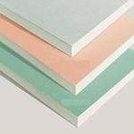
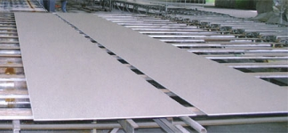
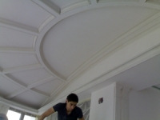



<!-- Featured News -->

	

		

		

			
<a href="gipsokarton.html">Гипсокартон</a>

			
03-03-2009

			
Мы живём в эпоху технического прогресса, который царствует и на строительном рынке. Современные профессионалы всё активнее отдают предпочтение высокотехнологичным и многофункциональным разработкам: неудивительно, что практически каждый ремонт помещения
			<a href="gipsokarton.html">Читать дальше...</a>

		

	

	

		

		

			
<a href="svoystva.html">Свойства гипсокартона</a>

			
04-03-2009

			
Гипсокартон современный и многофункциональный строительный материал. Он обладает отличными свойствами, которые просто не заменимы при строительстве, ремонте, реконструкции и ...<a href="svoystva.html">Читать дальше...</a>

		

	

	

		

		

			
<a href="vid.html">Виды гипсокартона</a>

			
06-03-2009 

			
На данный момент существует несколько видов гипсокартона. Каждый вид используется при определенных условиях и в определенных местах. Поэтому прежде чем покупать и использовать, надо изучить все виды.<a href="vid.html">Читать дальше...</a>

		

	

	

		

		

			
<a href="structura.html">Структура гипсокартона</a>

			
07-03-2009 

			
Гипсокартон или как его еще называют гипсокартоновый лист, состоит из строительного гипса и специального картона. Гипсокартон на 93% состоит из гипса (<a href="structura.html">Читать дальше...</a>

		

	

	

		

		

			
<a href="technology.html">Технология гипсокартона</a>

			
06-03-2009 

			
Для того чтобы окраска гипсокартона прошла нормально следует выполнять некоторые правила:<a href="technology.html">Читать дальше...</a>

		

	

	

		

		

			
<a href="histori.html">История гипсокартона</a>

			
10-03-2009 

			
Историю развития гипсокартона следует начать с его главного компонента – гипса. Гипс — это природный камень, который находиться в недрах земли. Цвета гипса: белый, серый, желтоватый.<a href="histori.html">Читать дальше...</a>

		

	

	

		

		

			
<a href="future.html">Будущее гипсокартона</a>

			
10-03-2009 

			
Изучив другие разделы сайта думаю становится понятно, что гипсокартон это материал будущего.Он обладает потрясающими свойствами, которые очень необходимы в наш век. Он достаточно легкий. Хорошо сгибается и принимает самые сложные формы, что позволяет воплотить в реальность самые смелые дизайнерские решения.<a href="future.html">Читать дальше...</a>

		

	

<!-- End Featured News -->
