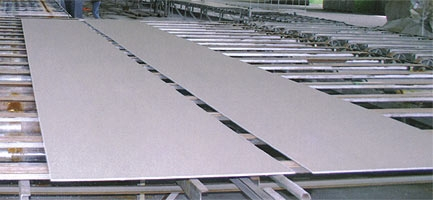



Гипсокартон или как его еще называют гипсокартоновый лист, состоит из строительного гипса и специального картона. Гипсокартон на 93% состоит из гипса (сердечник листа), на 6% из специального картона и 1% составляю вещества такие как: крахмал, влага.
Длинна гипсокартоновых листов от 2,5-3,0 м., ширина 1,2 м. и толщина 6-18 мм

{: style="float:right; margin:10px"}

Гипсокартон обладает сложной химической формулой. Разнообразные цвета гипса объясняются количеством примесей в гипсовом камне. Но достаточно часто это порошок белого или серого цвета. Так цвет гипса зависит от обжига.

Такой гипс получают благодаря термической обработке пригородного гипса, который имеет формулу CaSO4*2H2O. Гипс это минерал из группы сульфатов состоящий в основном из CaSO4*2H2O, а так же не большое количество примесей.

Гипс – это природный камень в виде бесцветных или белых кристалликов. Так же данной породе присущ стеклянный блеск. Плотность гипса составляет 2,3 г/см3.

