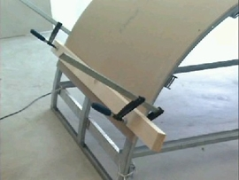



Гипсокартон современный и многофункциональный строительный материал. Он обладает отличными свойствами, которые просто не заменимы при строительстве, ремонте, реконструкции и т.д.

Гипсокартон благодаря своим физическим и гигиеническим свойствам идеально подходит для ремонта жилых помещений. В нем нет даже малейшего содержания токсичных веществ. А значитгипсокартон не способен причинить вред окружающей среде.
{: style="float:right; margin:10px"}

Если в помещении переизбыток влаги то гипсокартон будет поглощать ее, если не хватка то наоборот отдавать. Это очень важное и ценное свойство гипсокартона. Не зря говорят что гипсокартон “дышит”.
 Гипсокартон электрически нейтральный материал, энергосберегающий, а так же обладает не плохими звукоизоляционными свойствами. Так же он не горюч, огнестоек, влагостоек, а так же обладает ветроизолирующим свойством.

Используя при ремонте гипсокартон, Вам не придется создавать не комфортные условия и огромные кучу мусора и грязи, ведь при его использовании исключены “мокрые” процессы.
Так же кислотность гипсокартона идентична кислотности кожи человека, что делает его еще более безвредным, безопасным и выгодным при использовании. Благодаря своим свойствам гипсокартон самостоятельно регулирует микроклимат в помещении.

Еще одним незаменимым свойством гипсокартонная является его способность хорошо сгибаться и принимать практически любую форму. Это помогает реализовать самые смелые дизайнерские планы и желания.

Гипсокартон обладает еще и потрясающими технологическими качествами. У гипсокартонных конструкций относительно малая масса, что делает их не заменимыми в зданиях, где идет реконструкция или дома, в которых не возможно применить стандартную отделку.
Так же гипсокартон можно легко разрезать ножом или распилить. Уникальные свойства этого материала делают его передовым на рынке стройматериалов.

