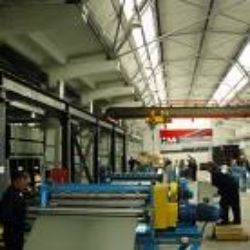



Производство гипсокартона происходит в несколько этапов. На первом этапе гипсовый камень разбивают на более мелкие камешки, затем получившийся щебень стачивают в порошок. На втором этапе измельчённую смесь нагревают в печи, для удаления воды. При этом не допускается контакта самого гипса с огнём.

{: style="float:right; margin:10px"}

Таким образом, получается густая гипсовая смесь, которую ещё раз увлажняют, после чего добавляют специальные «присадки». На четвёртом этапе тщательно всё перемешивают и покрывают этой однородной смесью картонную ленту. Гипс и картон пропускают через формовочный узел вследствие чего, и получается гипсокартонное полотно.

На завершающем этапе его разрезают на более мелкие куски и отправляют в сушильную печь.

По современной технологии гипсокартона его сушат при температуре 200 градусов. Поскольку мощность заводов многократно возрастает, производство гипсокартона составляет миллионы кв метров листов за год.
