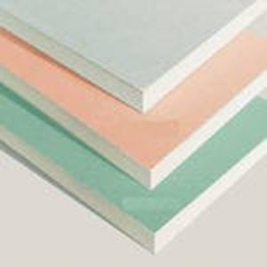



На данный момент существует несколько видов гипсокартона. Каждый вид используется при определенных условиях и в определенных местах. Поэтому прежде чем покупать и использовать, надо изучить все виды.

Виды гипсокартона:

1.	Обычный гипсокартон.

{: style="float:right; margin:10px"}

Обычные гипсокартоновые листы не обладают никакими особыми свойствами и их лучше всего использовать в помещениях с влажность до 70%. Цвет этого гипсокартона: серый или синий.

2.	Огнестойкий гипсокартон.

Огнестойкий гипсокартон содержит специальные армирующие добавки (стекловолокно), которые позволяют ему выдерживать высокие температуры. Данный вид лучше всего применять для обшивки чердачных помещений и любых других мест, где повышенная опасностью возгорания. Цвет этого гипсокартона: серый, красный.

3.	Влагостойки гипсокартон.

Данный вид гипсокартона следует применять в местах с повышенной влажностью (более 70%), такие как сауна, кухня, ванна и т.д. Он отличается импрегнированным картоном. Так же в данный вид гипсокартона добавляют гидрофобные и антигрибковые добавки. Цвет данного гипсокартона: зеленый или синий.

4.	Влагостойкий гипсокартон с повышенной защитой от открытого огня

Этот вид гипсокартона хорош тем, что вобрал в себя свойства двух видов. Тем самым он более функционален и его можно применять в самых сложных условия, когда и влажность большая и опасность возгорания. Это можно сказать, универсальный вариант данного строительного материала. Цвет гипсокартона: красный.
Вот и все что нужно знать о видах гипсокартона. Есть виды под определенные условия, а есть и универсальные. Какой выбрать Вам зависит от условий, в которых Вы хотите его применить.
Но в любом случае у Вас есть выбор, а значит, ремонт не будет стоять на месте	