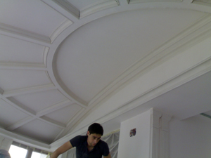



Начинать работу следует с определения количества материала необходимого для выполнения ремонта. Поэтому для начала стоит замерить площадь помещения, и закупить необходимое количество материала. Лучше всего покупать гипсокартон с запасом, чтобы не приходилось бегать в магазин.
Так же сразу стоит купить все необходимые инструменты, которые будут использоваться при ремонте: сухие смеси, гвозди, крепежные винты и соединительная лента. Само собой необходимо купить и все инструменты, которые могут понадобиться при работе с гипсокартоном. Закупайте сразу все, чтобы не отвлекаться от процесса.

Меры предосторожности при работе с гипсокартоном.

Работа с гипсокартон может быть вредна для здоровья и самой работы, если не следовать простым правилам.

1. Всегда работать в очках.

Гипсокартоновая пыль очень сильно раздражает глаза. Да же если Вы не аллергик, Вы все равно будете уязвимы. Поэтому обязательно работать в очках.

2.	Использовать респиратор.

Пыль от гипсокартона так же раздражает и дыхательные пути. Поэтому берегите свои легкие, купите маску или респиратор для безопасности Вашего здоровья.

3.	Вентиляция помещения.

При работе с гипсокартоном необходимо сделать “правильную вентиляцию”. В помещении должно быть достаточно свежего кислорода, чтобы работники не задыхались от его не хватки. Поэтому стоит задуматься над покупкой вентилятора (или нескольких).

4.	Стремянки и лестницы.

Будьте очень внимательны и осторожны при использовании лестниц и стремянок. Всегда проверяйте, чтобы ножки крепко упирались в пол (землю). Так же не следует вытягиваться в стороны и вверх, чтобы закрепить лист, Вы можете упасть.

5.	Использование инструментов.

Каждый инструмент нужно использовать строго по его назначению, а не делать из него “универсальный”. У каждого инструмента есть специальное предназначение, поэтому используйте его правильно.

6.	Уход за инструментами.

Внимательно следите за своими инструментами. Все режущие инструменты должны быть заточены, а то ремонт превратиться в каторгу. Так же следует держать все инструменты в безопасном месте.

7.	Дети.

Следите за тем, чтобы на строительной площадке не было детей. Чтобы они не трогали электроинструменты, а так же строительные материалы, растворители, смеси.

8.	Мусор.

Понятно, что при ремонте не избежать грязи и мусора, но не нужно делать из помещения свалку. Старайтесь, как можно чаще проводить мини уборки.

Резка гипсокартоновых листов.

Старайтесь использовать цельные листы гипсокартона, где только можно. Резать лист гипсокартона следует так, чтобы его конец приходился на: стойки, балки, перекладины.
Для того, чтобы правильно отрезать лист гипсокартона по длине необходимо правильно установить. Сделайте так, чтобы конец листа выступал за край, до которого Вы намереваетесь положить гипсокартон. Потом замерьте длину с помощью рулетки. Следом пометьте ножом начало и конец разреза.

Проведите специальным ножом надрез по линии разметки. Теперь осталось не сильно ударить по любой части и гипсокартон должен будет сломаться точно по линии. При таком методе бумага, которая покрывает сердечник гипсокартона, снизу не разорвется. Просто проведите ножом по линии разметки, чтобы отделить нижний слой.
Если Вам нужно разрезать гипсокартон в местах, где есть внутренние углы, то можно применить следующую технику. Необходимо использовать специальный гипсокартоновый нож. Сделайте надрез в том месте, где необходимо разрезать лист и потом резким движением отогните край назад. После этого Вам опять придется обрезать бумагу, которая находиться снизу листа.

Как закреплять гипсокартон на стены и потолок.

Закрепление гипсокартона лучше производить сверху вниз. Следите за тем, чтобы листы гипсокартона располагались строго перпендикулярно несущим конструкциям. Начинать крепеж гипсокартоновых листов лучше с потолка, так как стеновые панели будут дополнительной опорой.
Прежде чем крепить гипсокартон к потолку на нем нужно разметить расположение балок. Так же на листах гипсокартона которые расположены на потолке следует пометить положение несущих конструкций стен. Это облегчит попадание шурупов в опорные балки при отделке стен.

Отверстия для: выключателей, осветительных приборов и вентиляции.

Перед тем как Вы решите делать отверстия для вентиляции, осветительных приборов и выключателей Вам следует точно измерить и пометить где, какое отверстие будет располагаться.
Если Вы собираетесь сделать отверстия для выключателей и вентиляции, то Вам следует сначала замерить расстояния от правого и левого края стены. А так же снизу и сверху до вентиляционного отверстия или коробки с выключателем. Результат замера перенесите на лист гипсокартона и воспользуйтесь специальным ножом или ножовкой для выполнения отверстия.
Для осветительных приборов проводиться замер от того места, куда будет крепиться край гипсокартонового листа, до патрона осветительного прибора. То же самое сделайте от места, где будет крепиться второй край гипсокартонового листа. Затем переносим результаты замера на лист гипсокартона. Потом следует измерить радиус осветительного прибора, и начертите его на листе гипсокартона.
Можете воспользоваться циркулем и нарисовать отверстие с помощью него. Затем специальным ножом обведите круг и постучите молотком, чтобы выпала середина.
